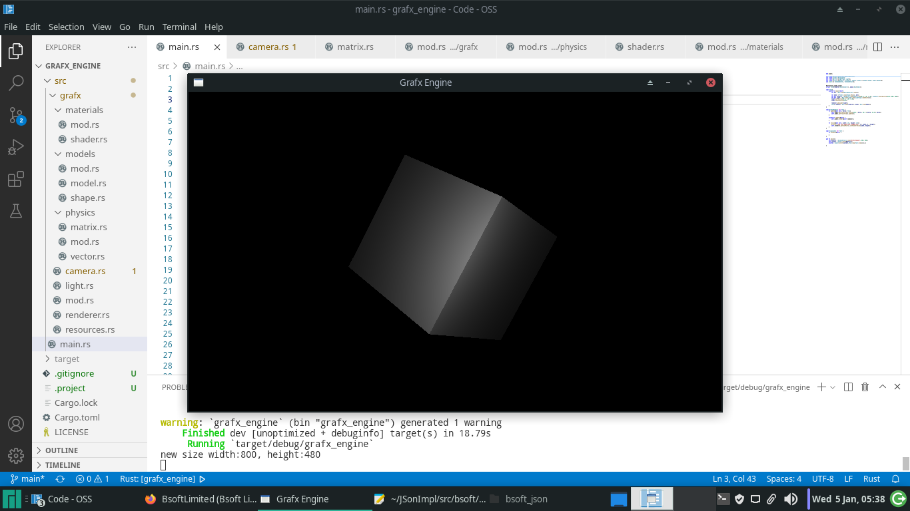

# Grafx Engine
#### A very simple and easy to use 3D Game Development Framework written entirely in Rust using GLutin, OpenGL from scrach with inspirations from libgdx framework, this is actually a Rust version of my Grafx Engine (3D Game Development Framework writen in C++). 

This framework is focused on simplicity, no clever tricks or complex algorithm, just straight forward design and implementation yet making it roboost enough to
write all kinds of games and applications with, once you figure out how all the components react with each other, you will be able bend them to your will.

### Getting Strated
first to render any thing to the screen what you need is a window. to create a widnow, you will need two things
- WindowDetails : this contains the title and the initial width and height of the window.
- WindowHandler : this trait contains the functions to be called by the window eg. render, resize, etc.

    #### to create a WindowDetails
    ```rust
    mod grafx; //import the grafx engine library
    
    use grafx::WindowDeatils; // import the window details trait
    
    fn main(){
        let details = WindowDetails::new("Grafx Engine", 800, 480); // initializing a windows details.
        let context = grafx::init(&details); // create a context with it.
    }
    ```
   
    #### implementing the windowHandler trait
    a quick note, windows handler trait extends Disposable tait, so you will need to implement both.

    ```rust
    use crate::grafx::Disposable; // import disposable tarit
    use grafx::{WindowDetails, WindowHandler}; // import the window handler trait

    struct Test; // create a struct to implement the windows handler trait

    impl WindowHandler for Test{
        fn update(&mut self, delta: f32){} // called every frame just after the render function. use for caluculations.
        unsafe fn render(&self) {} // called every frame, used to decide what to render to the sreen.
        fn resize(&mut self, width: i32, height: i32){} // called when ever the window is resized.
    }

    impl Disposable for Test{
        fn dispose(&self){} // called when the window closes, used to clearup resources from memory.
    }
    
    fn main(){
        let details = WindowDetails::new("Grafx Engine", 800, 480);
        let context = grafx::init(&details);
        unsafe{  grafx::start(context, Box::new(Test{})); } // start the window using the unsafe start function which takes a pointer to the window handler
    }
    ```
    runing this code now, you should have your window appear on the screen. now lets render something.
    
### Rendering a box to screen
First of all, to render something to the screen, you will need a Renderer. A renderer needs three components.
- ViewPort : this scales game models to the screen.
- Camera : well this is self explanatory every game needs a camera of some kind, which determines what is rendered to the screen.
- Light : Again self explanatory, think of it like the same light you know and love.

    #### Setting up the ViewPort
    ViewPort comes in two different flavours, which is Perspective and Orthographic.
    - Perspective : Used for 3D games.
    - Orthographic : Used for 2D games.
    
    in our case we want to display a 3D cude, so Perspective ViewPort is the logical choice. this takes three arguments
    which are:
    - Field of View : this is the angle in which the models are scaled depending to their position relative to the camera.
    - View Port Width: this is the width of the screen.
    - View Port Hieght: this is the hieght of the screen.
    ofcourse, you will need to update the view port width and height when the window is resized.
    
    ```rust
    use crate::grafx::ViewPort;
    
    let mut port = ViewPort::Perspective(45.0, 800, 480);
    
    fn resize(&mut self, width: i32, height: i32){
        println!("new size width:{w}, height:{h}", w = width, h = height);
        port.setViewPortSize(width, height);
    }
    ```
    #### Setting up the camera
    Camera acts and behaves like the camera you know in real life atleast to a fault, a camera takes the coordinates of it's position
    ```rust
    use crate::grafx::{Renderer, ViewPort, Camera};
    
    let camera = Camera::new(0.0, 2.0, -6.0);
    ```
    #### Setting up the light for our scene
    We have three different kinds of light, which are Directional, Point, and Spot Light.
    - Directioanl Light : this is used to simulate sunlight, it has only direction
    - Point Light : this light has no direction only point of origin and fades as object gets futher away from it.
    - Spot Light: this has both direction and point of origin, with a radius, this is used to simulate flash light, street light, etc.
    we are using point light for this example.
    
    ```rust
    use crate::grafx::{LightType, Light};
    
    let mut light = Box::new(Light::new(LightType::newPoint()));
    light.setPosition(0.0, 1.0, -3.0);
    light.setIntensity(3.0);
    
    ```
    
    #### Setting up the renderer
    we can now finally be able to setup our renderer
    
    ```rust
    use crate::grafx::Renderer;
    
    let mut renderer = Renderer::new(camera, port);
    
    renderer.addLight(light);
    ```
    
    #### Creating our Box Model
    A Model is the 3D components to be renderer, it takes two components
    - Material : this contain the color, texture, shininness properties of the model.
    - Shape : this contains the physical shape of the model.
    the model itself only contains the transformation of the 3D object, which is the scale, position and rotation of the 
    3D object.
    
    ```rust
    use crate::grafx::materials::BasicMaterial;
    use crate::grafx::models::{shape::Shape, model::Model};
    
    let mat = Box::new(BasicMaterial::new());

    let model = Model::new(Shape::Box(), mat);
    ```
    
    #### Finally rendering our box
    we need to make renderer and model components of the Test struct 
    ```rust
    #[allow(non_snake_case)]
    struct Test{renderer:Box<Renderer>, model:Box<Model>}
    
    impl Test{
        unsafe fn new()->Self{
            let mat = Box::new(BasicMaterial::new());

            let model = Model::new(Shape::Box(), mat);
            let mut renderer = Renderer::new(Camera::new(0.0, 2.0, -6.0), ViewPort::Perspective(45.0, 800, 480));
            let mut light = Box::new(Light::new(LightType::newPoint()));
            light.setPosition(0.0, 1.0, -3.0);
            light.setIntensity(3.0);

            renderer.addLight(light);
            Test{ renderer: Box::new(renderer), model: Box::new(model)}
        }
    }
    
    unsafe fn render(&self) {
        self.model.render(&self.renderer);
    }
    
    fn dispose(&self) {
        self.model.dispose();
    }
  ```
    
final full code below

```rust
mod grafx;

use crate::grafx::materials::BasicMaterial;
use crate::grafx::Disposable;
use crate::grafx::{LightType, Light};
use crate::grafx::{Renderer, ViewPort, Camera, models::{shape::Shape, model::Model}};
use grafx::{ WindowHandler, WindowDetails};


#[allow(non_snake_case)]
struct Test{renderer:Box<Renderer>, model:Box<Model>}

impl Test{
    unsafe fn new()->Self{
        let mat = Box::new(BasicMaterial::new());

        let model = Model::new(Shape::Box(), mat);
        let mut renderer = Renderer::new(Camera::new(0.0, 2.0, -6.0), ViewPort::Perspective(45.0, 800, 480));
        let mut light = Box::new(Light::new(LightType::newPoint()));
        light.setPosition(0.0, 1.0, -3.0);
        light.setIntensity(3.0);

        renderer.addLight(light);
        Test{ renderer: Box::new(renderer), model: Box::new(model)}
    }
}

impl WindowHandler for Test {
    fn update(&mut self, delta: f32){
        self.model.getTransform().rotate(30.0 * delta, 30.0 * delta, 30.0 * delta);
        self.model.getTransform().update();
    }

    unsafe fn render(&self) {
        self.model.render(&self.renderer);
    }

    fn resize(&mut self, width: i32, height: i32){
        println!("new size width:{w}, height:{h}", w = width, h = height);
        self.renderer.getViewPort().setViewPortSize(width, height);
    }
}

impl Disposable for Test {
    fn dispose(&self) {
        self.model.dispose();
    }
}

pub fn main(){
    let details = WindowDetails::new("Grafx Engine", 800, 480);
    let context = grafx::init(&details);
    unsafe{  grafx::start(context, Box::new(Test::new())); }

}
```
#### Screeshot of the final result

